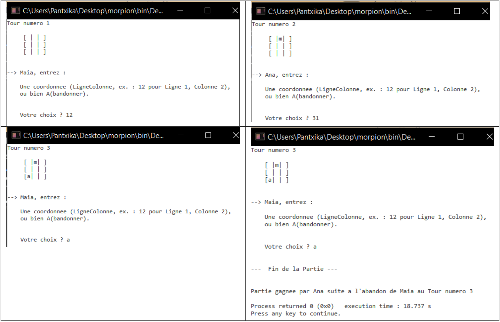

<div align="center">
    <h2>Morpion</h2>
</div>

### 1. Description du jeu 
> Jeu à deux joueurs nécessitant une grille de 9 cases (3 lignes et 3 colonnes).  
> Chaque joueur joue à tour de rôle. 
> Le but du jeu est d’aligner, avant son adversaire, 3 symboles identiques, horizontalement, verticalement ou en diagonale. 
> La partie se termine : 
>> ‐  Quand l’un des joueurs a aligné ses 3 symboles, et il gagne, 
>> ‐  Quand la grille est complète, et il y a égalité (pas de gagnant), 
>> ‐  Quand l’un des joueurs abandonne, et c’est alors l’autre joueur qui gagne. 

### 2. Spécification du besoin 
> Adaptation du jeu pour le programme à réaliser 
>> Le jeu se joue à deux joueurs humains.  
>> Une phase préalable de personnalisation permet à chaque joueur de saisir son prénom et le symbole choisi pour jouer. Le joueur n°2 doit fournir un prénom et symbole différents de ceux du joueur n°1. 
>> Lorsqu’arrive son tour de jouer, un joueur peut : 
>> -  Saisir la position de la case où placer son symbole (Ligne‐Colonne) 
>> - Ou bien Abandonner le jeu 
>
>On demande d’afficher 
>> Les règles du jeu avant de commencer le jeu 
>> L’état de la grille à chaque étape du jeu, ainsi que le numéro de l’étape en cours 
>> Un message de fin de jeu indiquant que la partie est finie, le type de fin de partie le gagnant, éventuellement le gagnant et le numéro de l’étape de la victoire 
>
> Exemples de comportements possibles 
>> Phase initiale de personnalisation (commune à tous les scénarios) 
 


#### Les scénarios qui suivent commencent tous par la phase initiale de personnalisation présentée ci-dessus. 
##### Scénario nominal : Un joueur gagne


##### Scénario alternatif 1 : Un joueur abandonne 


##### Scénario alternatif 2 : grille complète et pas de gagnant à la fin de la partie 


##### Scénario alternatif 3 : Un joueur se trompe dans sa saisie


### 3. Ressources à disposition 
> Idées pour la saisie de la demande utilisateur  
> On pourra lire une chaîne de caractères et en extraire les éléments de réponse attendus. 
 
##### Transformations entre valeurs de type char et int 
**int -> char**
> La fonction char() retourne le caractère de la table ASCII dont la position est fournie en paramètre. 
```cpp
int i = 65;  // Déclare un entier i et l’initialise avec la valeur 65  
char c;  // Déclare un caractère c  
c = char (i); // Retourne dans c le ième caractère de la table ASCII  
cout << c ;  // Affiche ꞌAꞌ, le 65ème caractère de la table ASCII 
```
**char -> int**
>La fonction int() retourne la position de la table ASCII à laquelle se trouve le caractère fourni en paramètre.
```cpp
char c = ꞌBꞌ;  // Déclare le caractère c et l’initialise avec la valeur ꞌBꞌ 
int i ;   // Déclare l’entier i 
i = int (c);   // Retourne dans i la position de ꞌBꞌ dans table ASCII 
```
##### Récupération de la majuscule / minuscule d’une lettre 
> Récupération de la majuscule d’une lettre 
>La fonction int toupper(int ch) retourne le code ASCII de la majuscule du paramètre ch si celui‐ci est une lettre de l’alphabet ou bien le code ASCII de ch si ce n’est pas une lettre de l’alphabet.
```cpp
char carac ;   
carac = toupper(ꞌaꞌ) ;    
cout << carac ;    // affiche ꞌAꞌ  
carac = toupper(ꞌ1ꞌ) ;     
cout << carac ;   // affiche ꞌ1ꞌ
````

##### Récupération de la minuscule : la fonction int tolower(int ch) fonctionne de manière analogue 
> Ces fonctions appartiennent à la bibliothèque `<cctype>`. Il faut donc les rendre accessibles en ajoutant la directive `#include <cctype>` en début de votre programme. 

### 4. Extensions possibles
> **MorpionEXT1**
> Le joueur n°2 est obligé de fournir un prénom et symbole différents de ceux du joueur n°1.
>
> **MorpionEXT2**
> Les dimensions de la grille peuvent être paramétrées en début de jeu : entre 9 et 27 cases (de 3 
lignesXcolonnes à 9 lignesXcolonnes), la grille devant toujours être carrée. 
